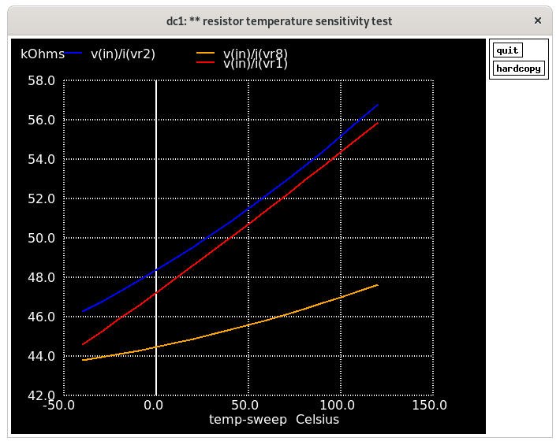

* Notes on resistor models

Resistance as determined by the test benches included with the models
for each model at l=10:

```
 1 sky130_fd_pr__res_generic_nd        291.20
 2 sky130_fd_pr__res_generic_pd       1962.15
 3 sky130_fd_pr__res_high_po_0p35    11617.76
 4 sky130_fd_pr__res_high_po_0p69     5310.80
 5 sky130_fd_pr__res_high_po_1p41     2556.68
 6 sky130_fd_pr__res_high_po_2p85     1266.97
 7 sky130_fd_pr__res_high_po_5p73      633.72
 8 sky130_fd_pr__res_high_po          3550.44
 9 sky130_fd_pr__res_iso_pw          15425.78
10 sky130_fd_pr__res_xhigh_po_0p35   57696.95
11 sky130_fd_pr__res_xhigh_po_0p69   29384.24
12 sky130_fd_pr__res_xhigh_po_1p41   14418.62
13 sky130_fd_pr__res_xhigh_po_2p85    7151.60
14 sky130_fd_pr__res_xhigh_po_5p73    3570.24
15 sky130_fd_pr__res_xhigh_po__base  20305.67
16 sky130_fd_pr__res_xhigh_po        21146.97
```

** Temperature effect

A simulation to determine the effect of temperature on resistance is in (resistor-tc.spice).




Resistors `generic_nd` (N diffusion?) and `generic_pd` (P diffusion?), along with the
`high_po` without suffix, show a positive temperature coefficient.

- For some reason, the value for `generic_nd` from the test bench listed above seems wrong,
at least when scaled.  I scaled it 4.125 times shorter to get it in the same ballpark as
the other resistors.
- The body of the `generic_pd` needs to be connected to a high voltage to prevent parasitic
diodes from conducting.

