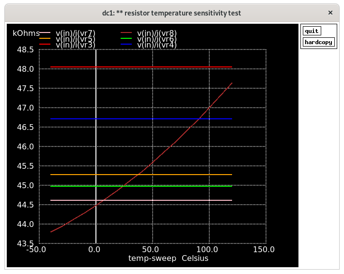
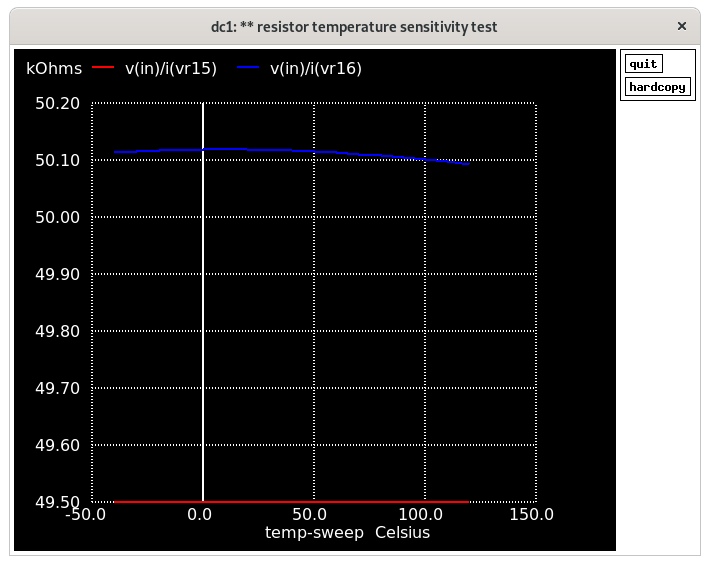
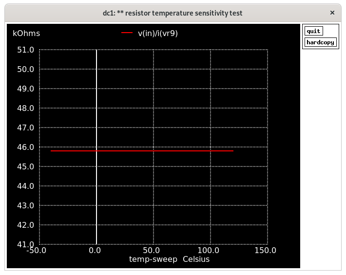

# Notes on resistor models

Resistance as determined by the test benches included with the models
for each model at l=10:

```
 1 sky130_fd_pr__res_generic_nd        291.20
 2 sky130_fd_pr__res_generic_pd       1962.15
 3 sky130_fd_pr__res_high_po_0p35    11617.76
 4 sky130_fd_pr__res_high_po_0p69     5310.80
 5 sky130_fd_pr__res_high_po_1p41     2556.68
 6 sky130_fd_pr__res_high_po_2p85     1266.97
 7 sky130_fd_pr__res_high_po_5p73      633.72
 8 sky130_fd_pr__res_high_po          3550.44
 9 sky130_fd_pr__res_iso_pw          15425.78
10 sky130_fd_pr__res_xhigh_po_0p35   57696.95
11 sky130_fd_pr__res_xhigh_po_0p69   29384.24
12 sky130_fd_pr__res_xhigh_po_1p41   14418.62
13 sky130_fd_pr__res_xhigh_po_2p85    7151.60
14 sky130_fd_pr__res_xhigh_po_5p73    3570.24
15 sky130_fd_pr__res_xhigh_po__base  20305.67
16 sky130_fd_pr__res_xhigh_po        21146.97
```

## Model names

I'm guessing that the `generic_nd` is an N diffusion resistor and the `generic_pd` a
P diffusion resistor.  I do not know the physical structure or implementation of the
other types or resistors.  More info is needed in the PDK.

## Temperature effect

A simulation to determine the effect of temperature on resistance is in
[resistor-tc.spice](resistor-tc.spice).


Resistors `generic_nd` (N diffusion?) and `generic_pd` (P diffusion?), along with the
`high_po` without suffix, show a positive temperature coefficient.

- For some reason, the value for `generic_nd` from the test bench listed above seems wrong,
at least when scaled.  I scaled it 4.125 times shorter to get it in the same ballpark as
the other resistors.
- The body of the `generic_pd` needs to be connected to a high voltage to prevent parasitic
diodes from conducting.



Of the `high_po` models, only the one without suffix shows any temperature coefficient.
The other variants seem to be specialized models for specific widths, but without proper
temperature behavior, they may be of limited use.  The fact that the generic model does
show a temperature effect seems to suggest the other models are deficient in this respect.



If you check the models, you'll see that all `xhigh_po` models of specific width are based
on the `xhigh_po__base` model, so I only put that one in the graph, together with the
generic `xhigh_po`.  Same situation: the models for specific widths don't show any
temperature coefficient, making them of limited use.  The generic model does show a
temperature dependence.



The `iso_pw` model also does not show temperature dependence.

## Thoughts

- Of the models that seem to implement a temperature dependence, the `xhigh_po` type
seems to be the most stable over a temperature sweep.
- The lack of temperature dependence in some of the models makes me question the
accuracy of the models overall.
- Is the lack of temperature dependence of some models a compatibility issue?  I'm
using `ngspice`, were the models made for a commercial variant of spice?  I do
get a bunch of "unrecognized parameter" warnings, two of which are `unrecognized 
parameter (tref) - ignored`, but they are for the `generic_nd` and `generic_pd`
models, which do exhibit temperature dependence.

